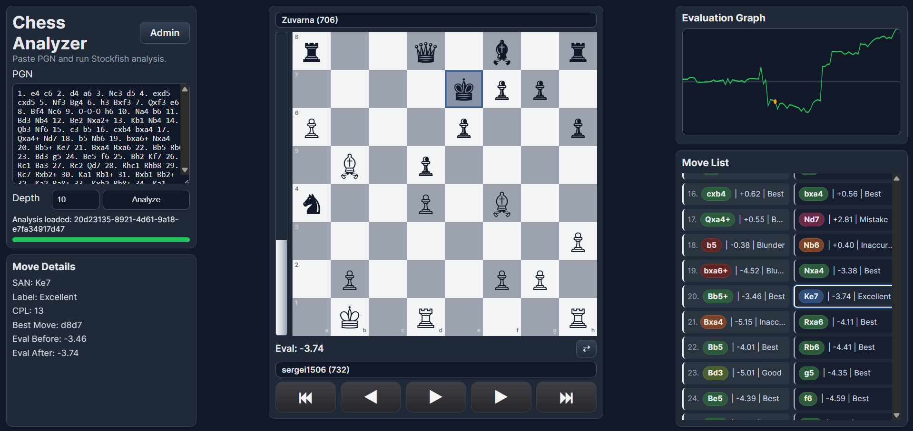
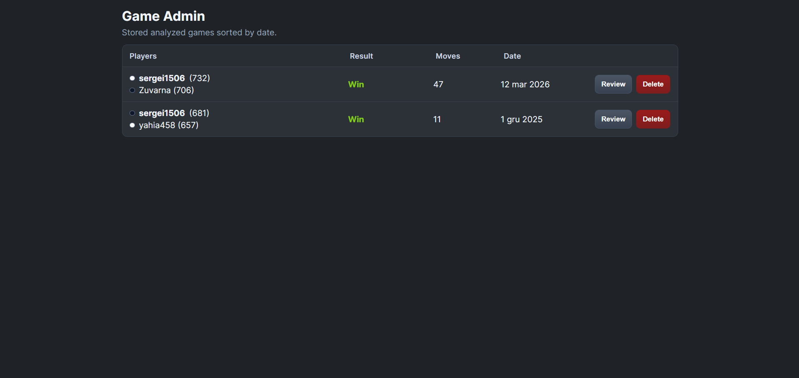

# ChessNpm Analyzer

A Stockfish-powered chess game analyzer that evaluates every move from PGN, labels move quality, detects critical moments, and shows results in a web UI.

## Screenshots

### Analysis UI


### Admin Page



---

## Table of Contents
- [Quick Start](#quick-start)
- [Configuration](#configuration)
- [Hello World](#hello-world)
- [Features](#features)
- [API Reference](#api-reference)
- [Pages and Navigation](#pages-and-navigation)
- [Frontend](#frontend)
- [Development Commands](#development-commands)
- [Troubleshooting](#troubleshooting)
- [Contributing](#contributing)
- [License](#license)
- [Credits](#credits)

---

## Quick Start

### Prerequisites
- Node.js 20+
- npm 10+
- Stockfish binary (Windows `.exe` or Linux/macOS binary)

### Install and Run

```bash
# 1) Clone
# git clone <your-repo-url>
# cd ChessNpm

# 2) Install dependencies
npm install

# 3) Configure env (example path from this project)
cp .env .env.local 2>/dev/null || true
# or edit .env directly

# 4) Start API + UI server
npm run start
```

Then open:
- `http://localhost:3000/` (UI)
- `http://localhost:3000/health` (health check)

---

## Configuration

Create or edit `.env` in project root:

```env
STOCKFISH_PATH=/absolute/path/to/stockfish
PORT=3000
ANALYSIS_STORAGE_DIR=/absolute/path/to/analysis/storage
ADMIN_PLAYER_NAME=sergei1506
```

Windows example:

```env
STOCKFISH_PATH=C:\Users\<you>\Documents\Projects\stockfish\stockfish.exe
PORT=3000
ANALYSIS_STORAGE_DIR=C:\Users\<you>\Documents\ChessAnalyzer\analyses
ADMIN_PLAYER_NAME=<your_chess_username>
```

WSL/Linux example:

```env
STOCKFISH_PATH=/mnt/c/Users/<you>/Documents/Projects/stockfish/stockfish.exe
PORT=3000
ANALYSIS_STORAGE_DIR=/mnt/c/Users/<you>/Documents/ChessAnalyzer/analyses
ADMIN_PLAYER_NAME=<your_chess_username>
```

If `ANALYSIS_STORAGE_DIR` is not set, default path is:
- `storage/local/analyses` (inside project root)

---

## Hello World

### Option A: Browser UI
1. Start server: `npm run start`
2. Open `http://localhost:3000`
3. Paste PGN
4. Click **Analyze**
5. Step through moves with **Prev/Next** and view eval per move

### Option B: API (synchronous)

```bash
curl -X POST http://localhost:3000/api/analyze \
  -H "Content-Type: application/json" \
  -d '{
    "synchronous": true,
    "pgn": "1. e4 e5 2. Nf3 Nc6 3. Bb5 a6",
    "settings": { "depth": 8 }
  }'
```

### Option C: API (async job flow)

```bash
# create job
curl -X POST http://localhost:3000/api/analyze \
  -H "Content-Type: application/json" \
  -d '{"pgn":"1. d4 d5 2. c4 e6","settings":{"depth":8}}'

# poll status
curl http://localhost:3000/api/analyze/<jobId>/status

# fetch result
curl http://localhost:3000/api/analyze/<jobId>/result
```

---

## Features

- Full PGN parsing and replay
- Per-move engine evaluation (cp/mate)
- Best move suggestion and PV line per ply
- Move quality labels: Best, Excellent, Good, Inaccuracy, Mistake, Blunder
- Critical moment detection
- Accuracy summary per side
- Two-pass analysis:
  - Fast pass for all moves
  - Deep pass for critical/high-CPL plies
- FEN evaluation cache (hit/miss tracked)
- Async job orchestration with progress tracking
- Persistent completed analyses by `jobId`
- Web UI with board, move list, eval graph, and move details
- Auto-redirect to `/analysis/:jobId` after analysis completion
- Keyboard navigation in analysis viewer:
  - `←` previous move
  - `→` next move
  - `Space` play/pause autoplay
- Admin page with stored games list (sorted by date) and one-click review

---

## API Reference

### `POST /api/analyze`
Creates analysis job (default) or runs sync mode.

**Body:**

```json
{
  "pgn": "1. e4 e5 2. Nf3 Nc6",
  "settings": { "depth": 10 },
  "synchronous": false
}
```

**Responses:**
- `202` async mode: `{ "jobId": "..." }`
- `200` sync mode: `{ "mode": "synchronous", "result": { ... } }`
- `400` validation error

### `GET /api/analyze/:jobId/status`
Returns current job state and progress.

### `GET /api/analyze/:jobId/result`
Returns:
- `200` completed result
- `202` still processing
- `500` failed job payload
- `404` unknown job

Completed analysis payload now includes the original submitted PGN as `result.pgn`.

### `GET /analysis/:jobId`
Opens the analysis UI page for a specific job id.

### `GET /admin`
Opens admin page listing stored analyzed games sorted by date.

### `GET /api/analysis/:jobId`
Returns persisted completed analysis from local storage.

Returns:
- `200` completed persisted result
- `404` unknown `jobId`
- `500` storage read/parse error

### `GET /api/admin/games`
Returns stored game list for admin page (players, result, moves, date), sorted by date descending.

### `DELETE /api/admin/games/:jobId`
Deletes a persisted stored game/analysis by `jobId`.

Returns:
- `200` `{ "ok": true, "jobId": "..." }`
- `404` unknown `jobId`
- `500` storage delete error

Persisted analysis payload includes the original submitted PGN as `result.pgn`.

Persisted files are stored at:
- `${ANALYSIS_STORAGE_DIR}/<jobId>.json`
- default fallback: `storage/local/analyses/<jobId>.json`

---

## Pages and Navigation

- `/` main analysis page for PGN input and starting new analysis jobs.
- `/analysis/:jobId` analysis viewer page for a saved game.
- `/admin` admin page with all persisted games.

Analysis flow:
1. Paste PGN on `/` and click **Analyze**.
2. App creates async job via `POST /api/analyze`.
3. UI polls status until completed.
4. UI redirects to `/analysis/:jobId` and loads persisted result.

---

## Frontend

UI is served from `public/` and includes:
- PGN input + depth selector
- Progress and state indicator
- Chessboard rendering from FEN
- Move list with eval text on every move row
- Eval graph over time
- Move detail panel
- Board flip support based on configured player color/viewer preference
- Keyboard controls (`←`, `→`, `Space`) for move navigation/autoplay
- Admin page actions: review game and delete persisted game

Evaluation is updated after every step selection (Prev/Next or move click).

---

## Development Commands

```bash
npm run typecheck
npm test
npm run phase1:smoke
npm run phase2:smoke
npm run phase3:smoke
npm run dev
```

---

## Troubleshooting

### `spawn stockfish ENOENT`
- Cause: `STOCKFISH_PATH` is missing or wrong.
- Fix: set correct absolute path in `.env`.

### `POST /api/analyze` returns validation error
- Ensure `pgn` is non-empty string.
- Ensure `settings.depth` is between `1` and `40`.

### Slow analysis
- Lower depth (`8-10`) for fast checks.
- Keep deep pass enabled for quality but limited critical reanalysis.

### Port already in use
- Change `PORT` in `.env`.
- Or stop the process using port 3000.

### UI loads but analysis fails
- Check server terminal logs.
- Verify Stockfish executable permissions/path.

---

## Contributing

Contributions are welcome.

Recommended flow:
1. Open an issue describing bug/feature first.
2. Create a focused branch.
3. Add/adjust tests with your change.
4. Keep PR scope small and include reproduction steps.
5. Ensure `npm run typecheck` and `npm test` pass before PR.

---

## License

This project currently has **no license file** in the repository.

If you plan to publish or accept external/corporate usage, add a license explicitly (for example MIT or Apache-2.0).

---

## Credits

- [Stockfish](https://stockfishchess.org/) for engine analysis
- [chess.js](https://github.com/jhlywa/chess.js) for PGN/chess logic
- [Express](https://expressjs.com/) for API server
- [Supertest](https://github.com/ladjs/supertest) for API integration testing
